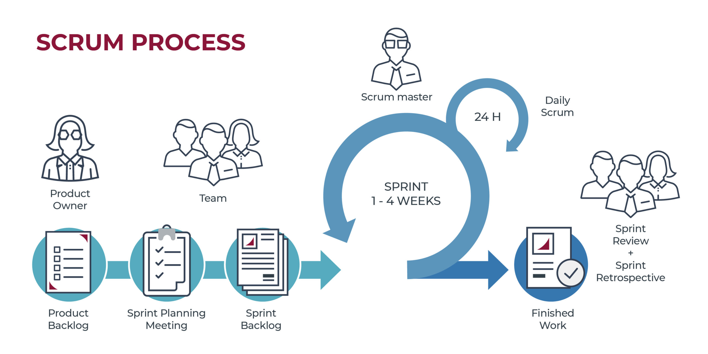

<!--
Realizar un markdown comentando las caracteristicas de la metodología Scrum
-->

# 🗓️ Scrum

*Scum* es una **metodología ágil** que se basa en la adaptabilidad al cambio para aumentar las posibilidades del éxito del proyecto.

## 🎯 Objetivo

Crear un producto en un tiempo dado con un grupo heterogénio de desarrolladores, pensando desde el primer momento que el problema inicial no esta completamente definido.

## 👨‍💻 Personajes

- Product owner: trabaja con el resto del equipo para mantener y priorizar una acumulación de características y requisitos del producto que deben construirse.
- Scrum master: mantiene el proyecto en marcha trabajando con el equipo para superar los obstáculos que han identificado y con los que han pedido ayuda. Al final del sprint, se demuestra el software en funcionamiento al propietario del producto y a las partes interesadas en la revisión del sprint, y el equipo realiza una retrospectiva para descubrir las lecciones que aprendieron, de modo que puedan mejorar la forma en que ejecutan sus sprints y crean software en el futuro.
- Team members: personas que trabajaran en el proyecto.

## 🖥️ Implementación



- El software se construye utilizando iteraciones con intervalos de tiempo llamadas *sprints*. Al comienzo de cada *sprint*, el equipo realiza una planificación del *sprint* para determinar qué características del *backlog* que construirán. Esto se denomina *sprint backlog* , y el equipo trabaja durante todo el *sprint* para crear todas las funciones que contiene.
- Todos los días, el equipo realiza una breve reunión presencial llamada *Daily Scrum* para actualizarse mutuamente sobre el progreso que han logrado y discutir los obstáculos que se avecinan. Cada persona responde tres preguntas: ¿Qué he hecho desde el último `Daily Scrum`? ¿Qué haré hasta el próximo *Daily Scrum*? ¿Qué obstáculos hay en mi camino?

## 🚀️ Eventos

Esta tabla refleja las diferentes ceremonias del Scrum y su carga conforme va pasando el tiempo.

```
Todos estos tiempos son orientativos. 
```

| Ceremonia            | Semana 1                                             | Semana 2   | Semana 3   | Semana 4   |
| ---------------------- | ------------------------------------------------------ | ------------ | ------------ | ------------ |
| Sprint Planning      | 2 horas                                              | 4 horas    | 6 horas    | 8 horas    |
| Daily Scrum          | 15 minutos                                           | 15 minutos | 15 minutos | 15 minutos |
| Sprint Review        | 1 hora                                               | 2 horas    | 3 horas    | 4 horas    |
| Sprint retrospective | 45 minutos                                           | 1:30 horas | 2:15 horas | 3 horas    |
| Grooming             | Entre el 5%y el 10% del tiempo disponible del Scrum. |            |            |            |

---

### Referencias

[¿Qués es Scrum?](https://www.atlassian.com/es/agile/scrum)

[Scrum (desarrollo de software)](https://es.wikipedia.org/wiki/Scrum_(desarrollo_de_software))
